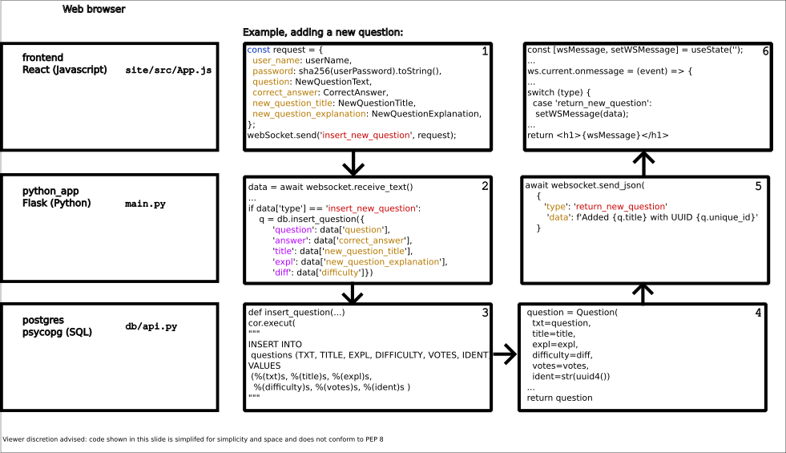

# Tower Tupilaqs


Image credit: Adapted from

- Ansgar Walk, CC BY-SA 3.0 <https://creativecommons.org/licenses/by-sa/3.0>, via Wikimedia Commons
- Wladyslaw (Taxiarchos228), CC BY 3.0 <https://creativecommons.org/licenses/by/3.0>, via Wikimedia Commons

## Introduction
Quiz game to determine if a piece of code is a bug or a feature for Python Discord Code Jam 2022.

Hosted on Kamatera as long as the free trial lasts: [Quiz page](http://83-229-86-43.cloud-xip.io:3000/)

original repository used for most of the jam got deleted or hidden, so pull request history is lost: [github.com/Devansh3712/towering-tupilaq](https://github.com/Devansh3712/towering-tupilaq)

## Program flow and libraries used


# Requirements
## Docker installation
Install docker for your operating system: https://docs.docker.com/get-docker/

Linux/Ubuntu
in docker-compose.yml, edit the `REACT_APP_BASE_URL` websocket to match your servers ip, or use localhost for development.
```
sudo snap install docker
sudo docker-compose up
```
first time, ensure db/db_config/database_docker.ini has `should_initialize_database=True` so the database gets initialized.

## Manual install
[poetry](https://python-poetry.org/) is used for dependency management. Follow the install guide for your system:
[https://python-poetry.org/docs/master/#installing-with-the-official-installer](https://python-poetry.org/docs/master/#installing-with-the-official-installe)

### Manual install - Add poetry to Windows Path
If poetry does not get added to your path ("poetry is not recognized as an internal or external command..."), click the windows start menu and search for "environment", you should get a hit for
"edit environment variables for your account" and a dialog similar to this: [win10-env](https://www.computerhope.com/issues/pictures/win10-envirvariables.jpg). In the top dialog, select (or create if it does not exists) the Path variable and add the directory where poetry was installed (i.e. "c:\Users\xx\AppData\Roaming\Python\Scripts"). Restart the command line-shell for the changes to take effect

### Manual install - Poetry install
In the towering-tupilaqs directory, use a terminal to:
```
poetry install
poetry run pre-commit install
```
also available as `make install` if you have make.

If problems with the requirements not solving, delete the `poetry.lock` file and try again (the `pyproject.toml` will be used instead and a new `poetry.lock` will be created).

### Manual install - Local database
Linux only, follow: [https://www.digitalocean.com/community/tutorials/how-to-install-postgresql-on-ubuntu-20-04-quickstart](https://www.digitalocean.com/community/tutorials/how-to-install-postgresql-on-ubuntu-20-04-quickstart) with username, password and db name "quiz". To configure password, use the `\password` command:
```
$sudo -u quiz psql
quiz=# \password
```
Windows only, follow: [https://www.postgresqltutorial.com/postgresql-getting-started/install-postgresql/](https://www.postgresqltutorial.com/postgresql-getting-started/install-postgresql/) when you have a PSQL shell open and logged into the postgres SUPERUSER, do the following:
```
postgres=# CREATE USER quiz WITH PASSWORD 'quiz';
CREATE ROLE
postgres=# CREATE DATABASE quiz WITH ENCODING 'UTF8' LC_COLLATE='English_United States' LC_CTYPE='English_United States';
CREATE DATABASE
```

### Manual install - Selecting database to use
To configure the database, copy either

- db/db_config/database_local.ini (assumes a local postgres database on localhost)
- db/db_config/database_docker.ini (assumes a local `docker-compose up` instance)
- db/db_config/database_remote.ini (uses a shared elephantsql.com instance, no setup required, may disappear in the future)

to db/db_config/database.ini.

e.g. on Windows:
```
xcopy .\db\db_config\database_remote.ini .\db\db_config\database.ini /f /y
```
or Linux:
```
cp db/db_config/database_remote.ini db/db_config/database.ini
```

the variable `should_initialize_database` controls if the database gets cleared when the application starts (should be True for development and is default False in the database_docker.ini.). WARNING: This is set to True when running tests, so ensure you are not testing against your production database.

### Manual install - Node install
#### Node Linux setup
```
$snap install node --classic
$node --version
v16.16.0
$sudo "curl -qL https://www.npmjs.com/install.sh > install.sh"
$npm --version
8.15.0
```

#### Node Windows setup
```
https://nodejs.org/en/download/
node -v
v14.18.1
```
### Node common setup
For both Windows and Linux, install project dependencies with
```
cd site
npm install
```
and serve the webpage with
```
cd site
npm start
```

### Manual install - Run
To serve the python websocket, use
```
poetry run uvicorn main:app --reload
```
also available as `make serve` if you have make.

# View and Play
This should serve:

- http://127.0.0.1:3000

For debug, the python code will log to `tupilaqs.log`.


# TODO

- Nicer frontend (Assigned to Hels15)
  - Show difficulty level as string
  - Prettify "Upvote question" button
  - Prettify "Next question" button
  - Question submission - Larger text area for code (Assigned to Jock)
  - Question submission - Make "Bug"/"Feature" a dropdown or some other way of ensuring user can only enter either "Bug" or "Feature".
